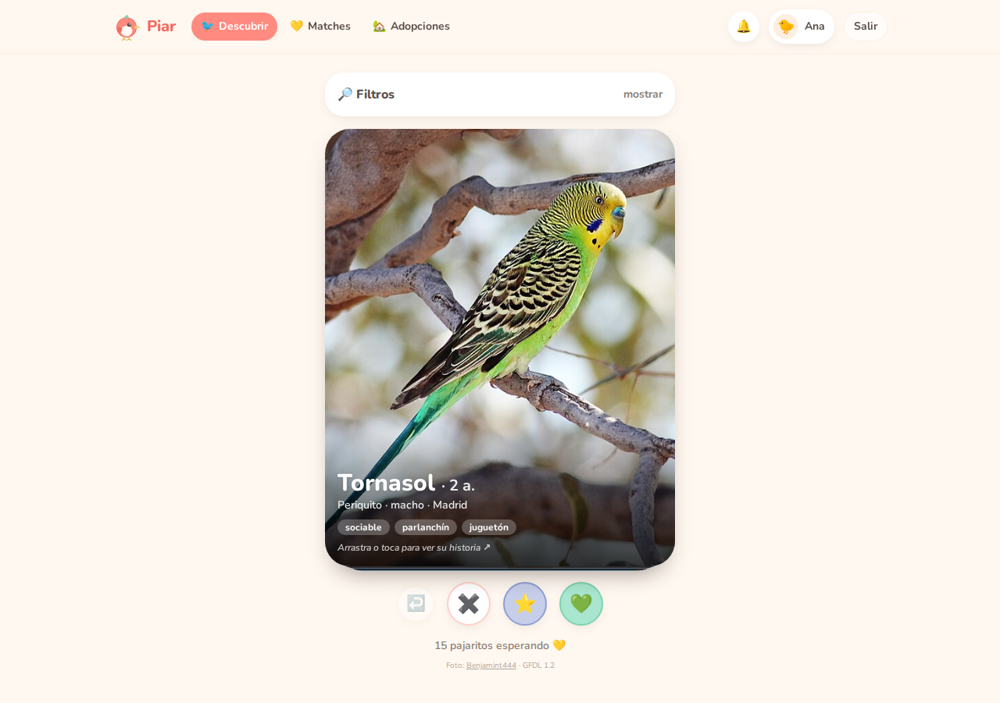
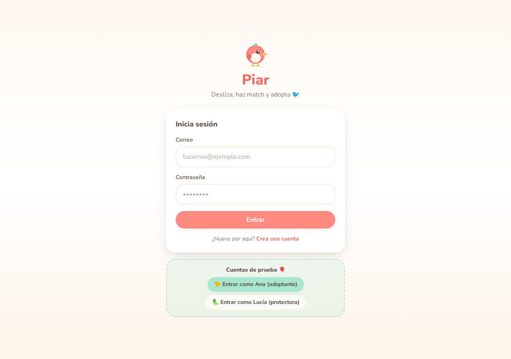
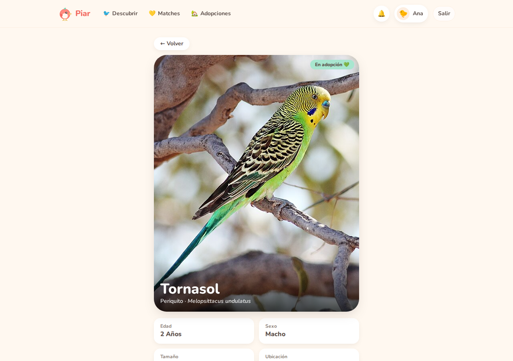
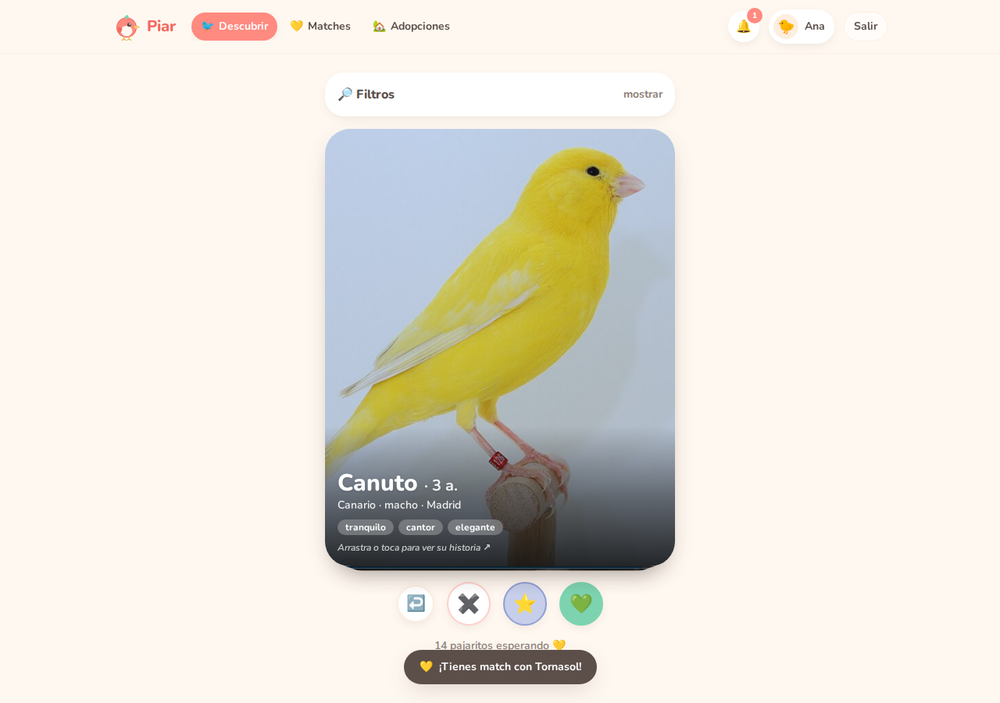
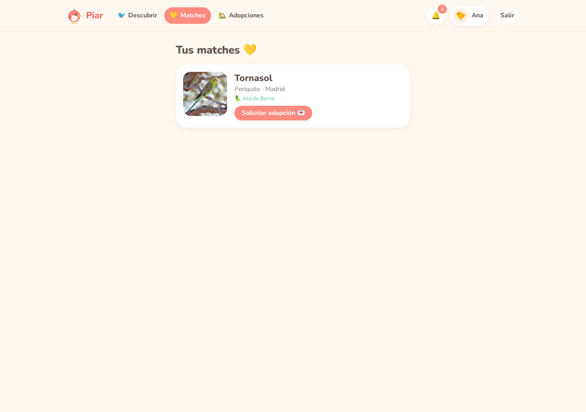
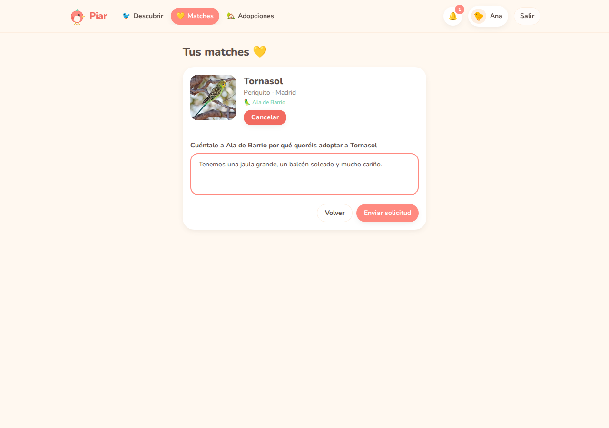
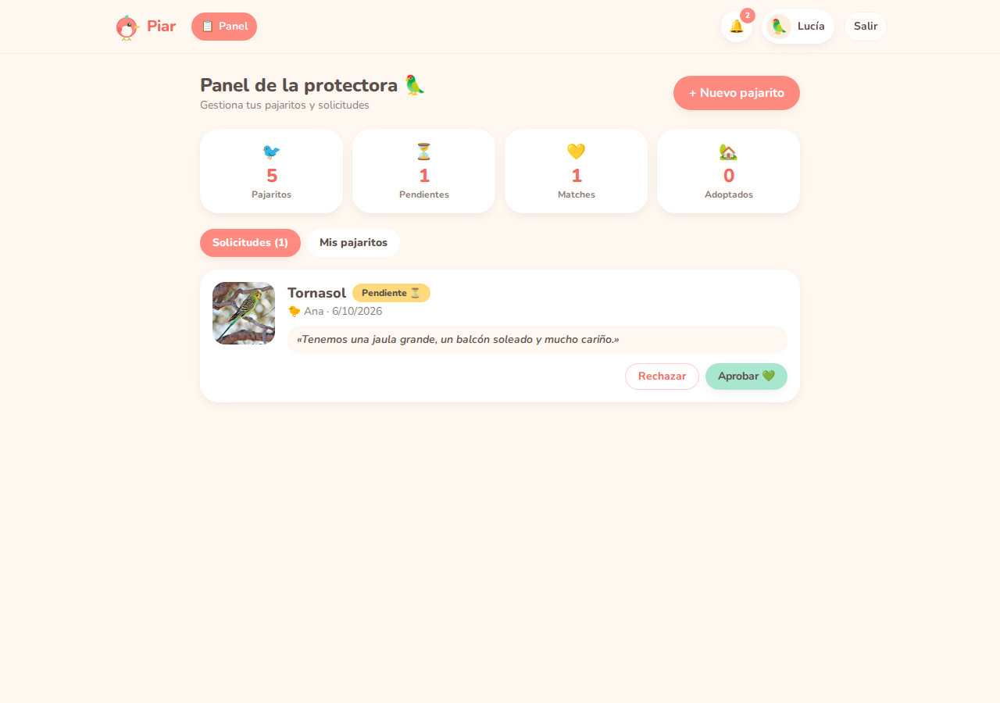
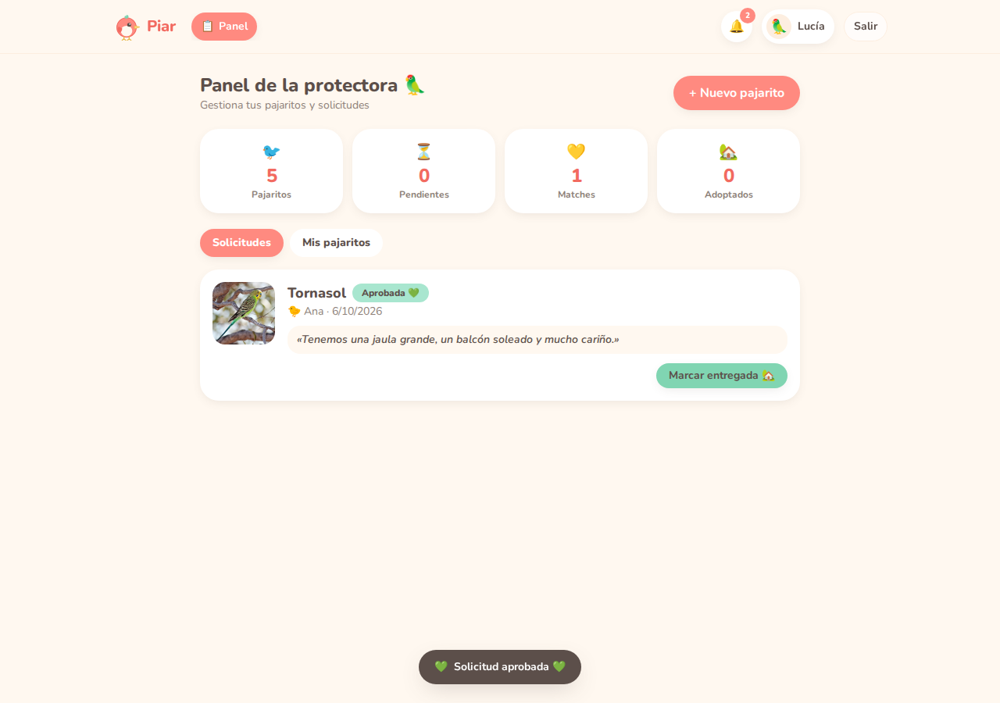
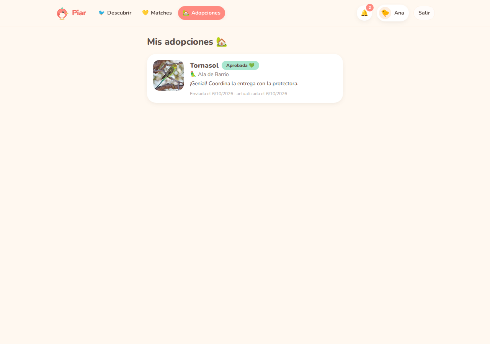

# 🐦 Piar — Adopción de pajaritos con swipe

> Desliza, haz match y **adopta un pajarito** que busque hogar.
> Un clon de Tinder para aves, con dos roles (adoptante y protectora), matches,
> solicitudes de adopción y seguimiento de estados.



---

## ✨ Qué incluye

### 🐤 Adoptante
- **Feed con swipe**: arrastra la tarjeta (← descartar, → like, ↑ super like) o usa los botones / teclado (← → ↑).
  Toca la tarjeta para abrir su ficha.
- **Filtros**: especie, ciudad, tamaño y edad máxima.
- **Ficha completa**: historia, salud, carácter, energía y datos de la protectora.
- **Matches**: cuando la protectora corresponde a tu like (llega una notificación en unos segundos).
- **Solicitudes de adopción**: envía un mensaje y sigue su estado
  (`pendiente → aprobada → completada`, o `rechazada`).
- **Notificaciones** in-app con campana y contador de no leídas.
- **Perfil** con actividad y botón para reiniciar la demo.

### 🦜 Protectora
- **Panel con estadísticas**: pajaritos, solicitudes pendientes, matches y adopciones.
- **Gestión de solicitudes**: aprobar, rechazar y marcar como entregada
  (cada acción actualiza el estado del pájaro y notifica al adoptante).
- **CRUD de pajaritos**: crear, editar y borrar fichas (con confirmación;
  no deja borrar si hay solicitudes activas).
- No ve en el feed sus propios pajaritos.

## 🎮 Cuentas de prueba

| Rol | Correo | Contraseña | Entra en |
|-----|--------|------------|----------|
| Adoptante | `ana@piar.app` | `demo1234` | Feed y matches |
| Protectora | `lucia@piar.app` | `demo1234` | Panel (Ala de Barrio) |

En la pantalla de login hay botones para entrar directamente con cada una.

> 💡 El **primer like siempre termina en match** (y los super likes también) para que
> la experiencia completa se pueda ver en pocos segundos. Los likes posteriores
> corresponden con un 60 % de probabilidad, simulando que la protectora tarda
> unos segundos en revisarlos.

## 🛠 Stack técnico

| Capa | Elección |
|------|----------|
| Framework | React 19 + TypeScript + Vite 8 |
| Estilos | Tailwind CSS 4 (paleta *cute* pastel: crema, coral, menta) |
| Enrutado | React Router 7 (rutas protegidas por rol) |
| Estado | Context + hooks (`store/context.ts` + `AppProvider`) |
| Gestos | Pointer Events propios (sin librerías) |
| Tests | Vitest + Testing Library (jsdom) |
| Lint | Oxlint (0 warnings) |

### El truco de la arquitectura: la fake API

No hay servidor: `src/services/` es una **capa de API simulada** con latencia
realista que persiste en `localStorage`. Cada módulo es *stateless* (lee, muta
y guarda), de modo que sustituirla por un backend real
(REST, Supabase, Firebase…) solo requiere reimplementar ese paquete:

```
src/services/
├── db.ts            # carga/guarda la BD, siembra, latencia simulada
├── auth.ts          # registro/login con hash simulado + sesión
├── birds.ts         # listado con filtros + CRUD de la protectora
├── swipes.ts        # feed, swipe y "revisión" diferida de la protectora → match
├── matches.ts       # matches por usuario/protectora
├── requests.ts      # solicitudes con máquina de estados validada
├── notifications.ts # notificaciones
└── index.ts         # export agregado (fakeApi)
```

Las decisiones de negocio (permisos, transiciones de estado, duplicados,
carreras de adopción…) viven **dentro de los servicios**, de modo que están
probadas de forma independiente de la UI.

## 📁 Estructura del código

```
src/
├── components/    # SwipeCard (gestos), Layout+navbar, BirdForm, ui (botones…)
├── pages/         # Login, Register, Feed, BirdDetail, Matches, Adoptions,
│                  # Dashboard, Profile, NotFound
├── services/      # fake API (ver arriba)
├── store/         # contexto global: sesión, toasts, ticker de matches
├── data/          # semilla: 15 pajaritos, 3 protectoras, usuarios demo
├── types/         # tipos compartidos (Bird, Match, AdoptionRequest…)
├── lib/           # utilidades (fallback de fotos)
└── __tests__/     # 62 tests en 7 archivos
```

## 🧪 Tests

```bash
npm test          # ejecuta la suite (62 tests)
npm run test:watch
```

Cobertura por dominio:

| Archivo | Qué verifica |
|---------|--------------|
| `services.test.ts` | siembra, auth, filtros, swipe/match + probabilidad, máquina de estados de adopción, notificaciones |
| `App.test.tsx` | rutas protegidas, redirecciones por rol, login/logout/registro |
| `feed.test.tsx` | pila de tarjetas, gestos (arrastrar/teclado/tocar), deshacer, filtros, estados vacíos |
| `bird-detail.test.tsx` | ficha completa, like desde la ficha, errores |
| `matches.test.tsx` | matches, validación del mensaje, `pendiente → aprobada` |
| `dashboard.test.tsx` | aprobar/rechazar/completar, CRUD con confirmación, estadísticas |
| `profile.test.tsx` | actividad, reinicio de la demo |

## 🚀 Puesta en marcha

```bash
npm install
npm run dev       # http://localhost:5173
npm test
npm run build     # build de producción (tsc + vite)
npm run lint      # oxlint sin warnings
```

## 📸 Capturas

| | |
|---|---|
|  |  |
|  |  |
|  |  |
|  |  |

Las capturas se generan con la demo real:

```bash
npm i -D playwright-core && npx playwright-core install chromium-headless-shell
npm run dev -- --port 5199        # en otra terminal
node scripts/screenshots.mjs
```

## 📷 Créditos de las fotografías

Todas las fotos proceden de **Wikimedia Commons** y se usan bajo sus licencias
originales. Cada ficha de la app muestra su crédito, y aquí queda el detalle completo:

| Pajarito | Fotógrafo | Licencia | Archivo en Commons |
|----------|-----------|----------|--------------------|
| Tornasol (Periquito) | Benjamint444 | GFDL 1.2 | [Budgerigar-male-strzelecki-qld.jpg](https://commons.wikimedia.org/wiki/File:Budgerigar-male-strzelecki-qld.jpg) |
| Canuto (Canario) | NEWSchr | CC BY-SA 4.0 | [GelbA.JPG](https://commons.wikimedia.org/wiki/File:GelbA.JPG) |
| Nube (Ninfa) | Ganatron – paulweberphoto.com | CC BY-SA 4.0 | [Cockatiel_3.jpg](https://commons.wikimedia.org/wiki/File:Cockatiel_3.jpg) |
| Coral (Agapornis) | Charles J. Sharp | CC BY-SA 4.0 | [Rosy-faced_lovebird_(Agapornis_roseicollis_roseicollis).jpg](https://commons.wikimedia.org/wiki/File:Rosy-faced_lovebird_(Agapornis_roseicollis_roseicollis).jpg) |
| Sol (Guacamayo) | Wayne Deeker | CC BY 3.0 | [Aratinga_solstitialis_-captive-two-8a.jpg](https://commons.wikimedia.org/wiki/File:Aratinga_solstitialis_-captive-two-8a.jpg) |
| Verde (Cotorra) | danielskatz | CC BY 4.0 | [African_Rose-ringed_Parakeet,_Tendaba,_Gambia_1.jpg](https://commons.wikimedia.org/wiki/File:African_Rose-ringed_Parakeet,_Tendaba,_Gambia_1.jpg) |
| Diamantina (Diamante) | Ver fuente en Commons | CC BY 2.5 | [Zebra_finch_group.png](https://commons.wikimedia.org/wiki/File:Zebra_finch_group.png) |
| Pintón (Jilguero) | Giles Laurent | CC BY-SA 4.0 | [072_Wild_European_goldfinch…jpg](https://commons.wikimedia.org/wiki/File:072_Wild_European_goldfinch_at_the_Parc_Jura_vaudois_Photo_by_Giles_Laurent.jpg) |
| Pío (Gorrión) | Rhododendrites | CC BY-SA 4.0 | [House_sparrow_male_in_Prospect_Park_(53532).jpg](https://commons.wikimedia.org/wiki/File:House_sparrow_male_in_Prospect_Park_(53532).jpg) |
| Azucena (Tórtola) | stevem4560 | CC BY 4.0 | [2022-04-06_Streptopelia_decaocto…jpg](https://commons.wikimedia.org/wiki/File:2022-04-06_Streptopelia_decaocto,_Plovdiv,_Bulgaria_1.jpg) |
| Rayo (Arrendajo) | Luc Viatour | CC BY-SA 3.0 | [Garrulus_glandarius_1_Luc_Viatour.jpg](https://commons.wikimedia.org/wiki/File:Garrulus_glandarius_1_Luc_Viatour.jpg) |
| Brasa (Petirrojo) | Francis C. Franklin | CC BY-SA 3.0 | [Erithacus_rubecula_with_cocked_head.jpg](https://commons.wikimedia.org/wiki/File:Erithacus_rubecula_with_cocked_head.jpg) |
| Cielo (Herrerillo) | Francis Franklin | CC BY-SA 3.0 | [Eurasian_blue_tit_Lancashire.jpg](https://commons.wikimedia.org/wiki/File:Eurasian_blue_tit_Lancashire.jpg) |
| Trueno (Carbonero) | Frank Vassen | CC BY 2.0 | [Great_tit_(Parus_major)…jpg](https://commons.wikimedia.org/wiki/File:Great_tit_(Parus_major),_Parc_du_Rouge-Cloitre,_For%C3%AAt_de_Soignes,_Brussels_(26194636951).jpg) |
| Pluma (Abubilla) | Greg Schechter | CC BY 2.0 | [Israel._Eurasian_Hoopoe_(6497645007).jpg](https://commons.wikimedia.org/wiki/File:Israel._Eurasian_Hoopoe_(6497645007).jpg) |

## 🔮 Posibles siguientes pasos

- Chat entre adoptante y protectora tras el match.
- Subida real de fotos (Cloudinary/S3) y backend real (Supabase o API propia).
- Geolocalización y distancias en los filtros.
- Despliegue automático en Vercel/Netlify con CI (GitHub Actions: lint + tests + build).

---

Hecho con 💛 para pajaritos sin hogar. Proyecto de demo: ninguna adopción real se gestiona aquí.
